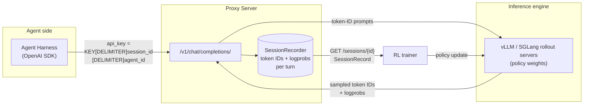
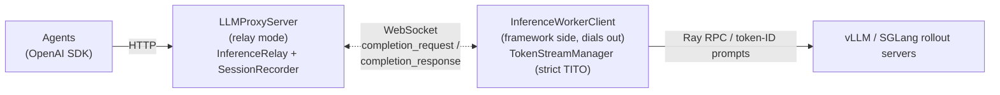
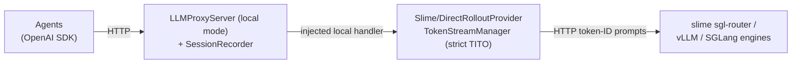
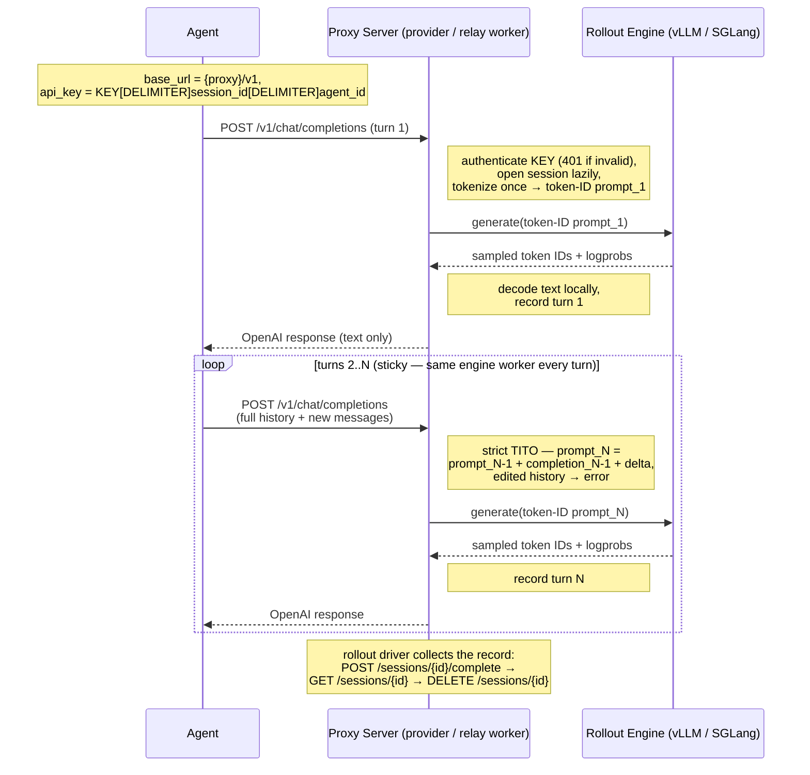

# RL Rollout Proxy Server

An OpenAI-compatible **recording proxy** that sits between agents and the RL rollout inference engine. Agents talk ordinary `chat/completions`; the proxy transparently captures, per session (= one rollout trial), the exact **prompt token IDs, completion token IDs, and logprobs** of every turn — the data an RL trainer needs — while enforcing **strict token-in-token-out (TITO)** so that recorded tokens are byte-identical to what the policy actually consumed and sampled.

> **Core design** — from the agent's perspective there is nothing proxy-specific except the composed API key.

## Role in RL training

Agentic RL trains a policy on multi-turn rollouts produced by an agent harness that only speaks the OpenAI text API. Training, however, needs token-level data, and **re-tokenizing conversation text does not reliably reproduce the tokens the model actually sampled** (token-merge drift at boundaries, chat templates stripping `<think>` blocks, tool calls re-serialized from parsed JSON, etc.). The proxy solves this by being the single point through which all agent LLM calls flow:



Each rollout is one **session**, which runs one or more **agents**. The session id and agent id are embedded in the API key the agent is given (**keyed routing**):

```python
client = OpenAI(
    base_url = f"{proxy_url}/v1",
    api_key  = f"{REAL_API_KEY}{DELIMITER}{session_id}{DELIMITER}{agent_id}",   # e.g. "sk-xxx-trial_042-agent_001"
)
```

The proxy authenticates the `REAL_API_KEY` part, extracts the session id and agent id, and opens the session lazily on the first request.

### Multi-agent rollouts

A rollout may spawn **several agents**; each is provisioned with a key naming its own agent id:

```python
api_key = f"{REAL_API_KEY}{DELIMITER}{session_id}{DELIMITER}{agent_id}"   # e.g. "sk-xxx-trial_042-planner"
```

Each `(session_id, agent_id)` pair owns an **independent strict-TITO token stream** — its own conversation, model pin, turn serialization, and sticky worker/endpoint binding — so a rollout's agents converse and generate concurrently without touching each other's streams (internally the inference side keys everything on the composed stream id `{session_id}{DELIMITER}{agent_id}`). The rollout stays the unit of recording and lifecycle: all agents' turns land in the one `SessionRecord`, interleaved in arrival order and tagged with their `agent_id`, and the session endpoints below fetch, complete, and delete the whole rollout — `DELETE` releases every agent's stream.

After the rollout, the driver collects the record:

| Endpoint                       | Purpose                                                  |
| ------------------------------ | -------------------------------------------------------- |
| `POST /v1/chat/completions`    | Agent-facing OpenAI endpoint (keyed routing)             |
| `GET /sessions/{id}`           | Fetch the `SessionRecord` (all turns)                    |
| `POST /sessions/{id}/complete` | Mark the rollout finished                                |
| `DELETE /sessions/{id}`        | Free the record and every agent stream's inference state |
| `GET /health`                  | Liveness / readiness, reports mode and connected workers |
| `WS /ws/worker`                | Inference workers connect here (relay mode only)         |

Each turn in a `SessionRecord` contains `agent_id`, `request_messages`, `prompt_token_ids`, `new_conversation`, `completion_text`, `completion_token_ids`, `completion_logprobs`, `finish_reason`, `weight_version`, and parsed `tool_calls`.

`weight_version` is the policy version the engine reported for that turn. A trainer that updates weights between rollout steps needs it to prove a rollout was on-policy: a session whose turns carry more than one version straddled a weight update, and the samples it yields silently mix two policies. It is `null` when the backend reports none (vLLM's OpenAI API), and a re-served lost-response retry reports the version its tokens were *sampled* under rather than the current one.

`request_messages` and `prompt_token_ids` store only the turn's **delta** — the messages / prompt tokens the request appended beyond the agent's previous turn — never the full history, which would grow the record (in memory and on disk) quadratically with the conversation. The assistant echo that opens a continuation's delta is not stored either: it is exactly the previous turn's `completion_text` / `tool_calls`, so a continuation's `request_messages` hold only the new non-assistant messages. Strict TITO (below) makes the delta lossless: every continuation prompt strictly extends its agent's token stream, so a reader rebuilds turn N's full values by concatenation **over the turns sharing that turn's `agent_id`**:

```
full_messages_N = full_messages_{N-1} + [assistant_{N-1}] + request_messages_N
full_prompt_N   = full_prompt_{N-1} + completion_token_ids_{N-1} + prompt_token_ids_N
```

where `assistant_{N-1}` is the assistant message rebuilt from turn N-1's `completion_text` / `tool_calls`. Both reset at every turn whose `new_conversation` is `true` (the agent's first turn, or a request that opened a fresh conversation — see strict TITO below): such a turn stores the full request instead of a delta, including any pre-existing assistant history, which no recorded turn could restore.

## Persisted session records

Every `SessionRecord` is also written to disk as JSON at `proxyserver/sessions/{mode}/{yyyy}-{mm}-{dd}-{hh}-{MM}-{ss}/{session_id}.json`, using the same `{mode}`/server-start-time directory scheme as the error logs below. The file holds the full record — exactly what `GET /sessions/{id}` returns — and is rewritten after **every turn**, so a rollout whose driver crashes, or that never calls `/sessions/{id}/complete`, still leaves its turns on disk. Deleting a session frees the in-memory record but keeps the file. Writes are atomic (temp file + rename), so a reader never sees a half-written record.

## Strict token-in-token-out (TITO)

The inference side keeps, per stream (one per agent of a session — see multi-agent rollouts above), the **authoritative token stream** — the exact prompt tokens fed to the engine plus the exact completion tokens it sampled — and builds every follow-up prompt as

```
prompt_{N+1} = prompt_N + completion_ids_N + gap + delta(new user/tool messages)
```

where `delta` tokenizes *only the new messages*, never the history. The assistant text echoed back by the agent is ignored for tokenization; the cached sampled tokens are authoritative. Any request that cannot be built as a strict extension of the session's stream — edited history, unexpected roles — is **rejected with an error**, never silently re-tokenized: a failed rollout is recoverable, a corrupted one is not.

`gap` closes the assistant message the way the chat template does. The template ends every message with `<|im_end|>\n`, but the engine stops *at* the sampled `<|im_end|>` and the delta render starts fresh at `<|im_start|>` — so that trailing newline belongs to neither, and without it every turn boundary would read `<|im_end|><|im_start|>user` where the template writes `<|im_end|>\n<|im_start|>user`: one token off the format the checkpoint was trained on, in the engine prompt *and* in the recorded stream the trainer rebuilds. The proxy therefore appends whichever part of that ending the completion did not itself carry — the bare newline after a natural stop, the whole `<|im_end|>\n` after a turn truncated at `max_tokens`. It is part of the turn's recorded `prompt_token_ids`, so the reconstruction formula above is unchanged.

One case is not a violation: a request carrying **no assistant message at all** cannot be a continuation (a strict extension always includes the previous turn's assistant echo) and contains nothing that would need re-tokenizing, so it opens a **new conversation** on the session — its full render starts a fresh stream, replacing the cached one. Agents that run several sequential conversations under one session id are served without ever re-tokenizing sampled content; each conversation's turns land in the same `SessionRecord`.

One more shape is **recovered** rather than rejected: a request that repeats the session's previous request *verbatim*. It cannot be a new turn (a continuation appends at least the assistant echo plus one new message) — it is exactly what an agent, or its OpenAI SDK's automatic retry, resends when a turn was generated and committed but the response was lost in transit (an agent- or proxy-side timeout, a dropped connection). The proxy re-serves the cached turn — same tokens, same logprobs, no second generation — so retries are idempotent and the expensive completion is never wasted. This covers the session's **opening** request too, which carries no assistant message and is usually the rollout's longest turn: only a *different* assistant-free request opens a fresh conversation, so an agent that means to re-sample the same opening prompt opens a new session instead. See [Timeouts, retries, and lost responses](#timeouts-retries-and-lost-responses).

## Timeouts, retries, and lost responses

Rollout turns are expensive, so a completion that outlives some timeout in the chain must neither be lost from the record nor strand its session. The timeout chain, outermost to innermost:

| Layer                               | Default | Knob                                            |
| ----------------------------------- | ------- | ----------------------------------------------- |
| Agent's OpenAI client               | 600 s   | agent-side (`OpenAI(timeout=...)`)              |
| Proxy waiting on a relay worker     | 600 s   | `relay_request_timeout` / `--relay-timeout`     |
| Provider HTTP to the engines/router | 900 s   | `request_timeout` on the slime/direct providers |

The relay default is aligned with the OpenAI SDK's 600 s client default — when your agents allow longer turns, raise `--relay-timeout` together with their client timeout. Whatever fires first, no committed turn is lost:

- **The proxy times out (relay mode)** — the agent gets a 503, but the request stays recordable for a grace window; when the worker's response lands late, the proxy records the turn anyway and notes it in the session's error log.
- **The worker's connection drops mid-generation** — in-flight requests stay pending rather than failing (the dispatch timeout is the backstop), and the worker buffers any response it could not send and re-sends it after reconnecting, so a transient drop resolves transparently.
- **The agent disconnects mid-turn (local mode)** — depending on the installed Starlette a disconnect may cancel the HTTP handler, but the generate→record pipeline runs shielded from that cancellation: it finishes detached, the turn is committed and recorded, and the agent's exact retry is re-served it — so even a turn longer than the agent's timeout completes and is never lost.
- **The agent times out or retries** — an exact retry of the lost request is re-served the already-committed turn (see strict TITO above), so the OpenAI SDK's default automatic retries are safe. Turns of one session are serialized at the rollout provider (the relay worker, or the proxy itself in local mode) on a per-session lock held through commit, so a retry racing its original — even one whose proxy request already timed out — simply waits for the original to commit and is then re-served, never sampled a second time.
- **Double delivery** — a re-served retry and a late orphan recording can both hand the recorder the same turn; the recorder deduplicates, so the turn lands in the `SessionRecord` exactly once.

Failures *before* a turn commits (an engine abort, an empty or logprob-misaligned completion, a transport error) leave the session's token stream untouched — a retry of the same request regenerates cleanly. One class of failure is *not* retried without bound: an engine rejection with a deterministic 4xx (e.g. vLLM refusing to serialize NaN logprobs as HTTP 400) is the engine's verdict on the request itself, so an exact repeat would only burn another full generation to hear the same verdict — and when that verdict takes longer to arrive than the agent's own timeout, the agent never hears it at all and retries the identical request forever, wedging the stream while the engine burns. After two live attempts, further exact repeats are failed fast with the stored rejection (no generation), so the error reaches the still-connected agent and the trial can abort instead of hanging. 5xx and transient 4xx (408/425/429) never trigger this, and the session's next successful turn clears it.

## Configuration

`proxyserver/configs/{engine}-{transport}.yaml` — one file per engine + transport-mode combination (`vllm-verl.yaml`, `sglang-verl.yaml`, `sglang-slime.yaml`, `vllm-direct.yaml`, `sglang-direct.yaml`; slime is SGLang-only so there is no `vllm-slime.yaml`), selected by `$INFERENCE_ENGINE` (default `vllm`) + `$TRANSPORT_MODE` (default `verl`), or named explicitly with `--config`. E.g. `sglang-slime.yaml`:

```yaml
inference_engine: sglang        # rollout engine behind the proxy
transport_mode: slime           # how token prompts reach it: verl | slime | direct
proxy_api_delimiter: "-"

host: 0.0.0.0                   # proxy bind address
port: 9400
rollout_session_dir: sessions   # relative → under proxyserver/
log_dir: logs
save_rollout_sessions: true
save_rollout_logprobs: true     # false → omit completion_logprobs from the persisted JSON (in memory always recorded)

# slime only (the *-verl.yaml files omit these):
router_url: http://<sglang-router-ip>:<port>   # slime's sgl-router
router_api_key: null                           # optional bearer token
context_length: 262144                         # the engines' context window, in tokens
```

The `*-direct.yaml` files fill in the engines' own endpoints:

```yaml
# direct only — the engines the proxy sends token-ID prompts to
# (lists, one entry per running instance; one api_key may be shared):
inference_engine_base_url: ["http://<engine-ip>:<port>/v1"]
inference_engine_api_key: ["<key>"]
```

Sampling params are resolved per turn as **runtime overrides (`PUT /sampling_overrides`) > `sampling_overrides` config > request > the model's bundled `generation_config.json` > the engine's own defaults**. The two override layers are the training side's pin over agent-requested values — distribution keys only (temperature, top_p, top_k, min_p, penalties; `max_tokens`/`stop` stay request-owned), the config layer restart-proof and the runtime layer replaced wholesale by each authenticated `PUT` (bare real API key — the keyed per-session form is refused) and echoed back as `{config, runtime, effective}` for the caller to verify; `GET /sampling_overrides` reports the same without auth, and both endpoints answer 501 in relay mode. Agents rarely set more than `temperature`/`max_tokens`, so request-omitted knobs (`top_p`, `top_k`, `min_p`, penalties) fall back to the publisher-recommended values shipped next to the tokenizer — never to hardcoded proxy values: sampling the raw full distribution (`top_p=1`, unbounded `top_k`) is what tips long agentic completions into repetition loops. (A `sampling_defaults` config field once sat between the request and those bundled defaults; it was removed, and a config still carrying it is refused at load rather than ignored.) Each session's effective params are logged on its first turn. Under the direct and slime transports the proxy also clamps `max_tokens` to the engine's remaining context window, so a long session ends in honest `finish_reason: "length"` turns instead of a storm of context-overflow rejections. Under `direct` the window is discovered — vLLM's `GET /v1/models` (`max_model_len`), a bare SGLang server's `GET /get_server_info` (`context_length`, else the scheduler's `max_req_input_len`). Under `slime` it is **stated**, as `context_length` in the config (or `--context-length`): slime's `sgl-router` answers `GET /get_server_info` from its own `RouterManager` stub — `{"router_manager": true, "routers_count": N, "workers_count": M}` — instead of forwarding a worker's payload, so there is no window to discover behind it. Set it to whatever the engines were launched with (SGLang's `--context-length`, i.e. slime's `--sglang-context-length`); left `null`, the proxy warns once and runs unclamped for the rest of the process.

**Rollout Routing Replay (R3, slime transport only).** With `return_routed_experts: true` (or `--return-routed-experts`), every `/generate` asks the SGLang engines for their per-token MoE expert selections — only the rows added since the previous turn (`routed_experts_start_len`), which the recorder appends into one whole-stream blob per agent; an engine that ignores the field is detected and sliced — what slime's `--use-rollout-routing-replay` replays in training; the engines must be launched with `enable_return_routed_experts` (slime sets that server arg from the same flag), and a missing payload fails the turn loudly rather than record a stream the trainer would crash on. The engine's base64-int32 payload is repacked to a 4×-smaller uint8 blob `{data, rows, cols, dtype}` and recorded on `SessionRecord.routed_experts` **per agent, latest turn wins** — each turn's capture covers the agent's whole stream so far, so one blob per agent supersedes all earlier ones and out-of-order deliveries can never shrink coverage. `GET /sessions/{id}` always carries the blobs; the per-turn disk snapshots omit them unless `save_rollout_routed_experts: true` (the session file is rewritten every turn, and the blobs are large). The trainer layers a per-step runtime toggle over the config baseline via `PUT /routed_experts` (body `{"enabled": true|false|null}`, bare real API key, echoed back as `{config, runtime, effective}`; `GET` reports the same without auth) — capture on for train steps, off for eval steps whose streams nothing trains on. Both endpoints answer 501 outside local slime mode, and the relay protocol does not carry the blob (`worker_client.py` flattens `engine_meta` to `weight_version`).

Tool parsing is not configured either: each model's **profile** (see below) names its tool-call parser, and the proxy parses completions into OpenAI `tool_calls` server-side (`proxyserver/tokenization/tool_parser.py`): `qwen3_coder` is the `<function=...><parameter=...>` XML dialect of the Qwen3.5 / Qwen3-Coder chat templates, `hermes` the JSON dialect of Hermes/Qwen2.5 templates, `llama3_json` Llama 3's bare-JSON dialect. A profile with no tool parser disables tool parsing for that model — agents then receive the completion as plain content (still cleaned of special tokens and leading reasoning) with `tool_calls: null`, which stalls any agent that dispatches on the `tool_calls` field. A training framework embedding the proxy may override the built-in parsers with its own factory (e.g. verl's `ToolParser.get_tool_parser`), which receives each parser's name.

Each OpenAI request must name a `model`, and the proxy decides what that claim means via `proxyserver/tokenization/mapping.json`, which maps each served model name to a **model profile** (`proxyserver/tokenization/{profile}.py`) — a small module stating that family's bundled tokenizer directory, its strict-TITO chat markers, its tool-call parser, and its reasoning format (see [proxyserver/tokenization/README.md](proxyserver/tokenization/README.md)). The session is **pinned** to its first request's model. The validated model is echoed in responses and recorded on the `SessionRecord`.

Everything in the file is owned by the proxy/training side — **agents are external and configure nothing here**. The agent owner is provisioned out-of-band with the proxy URL, the shared secret (`PROXY_API_KEY`), the keyed api_key format `{PROXY_API_KEY}{proxy_api_delimiter}{session_id}{proxy_api_delimiter}{agent_id}`, and the model name to request; their side stays an ordinary OpenAI SDK client. `inference_engine` names the rollout backend precisely so that the per-engine differences (`stop_reason` vocabulary, truncation reporting) are absorbed server-side and never surface to the agent. Explicit `--host`/`--port` flags win over the config.

`transport_mode` names how a token-ID prompt reaches the rollout engines — see [Transport modes](#transport-modes). Under `verl` the engines' own endpoints are **not** configured here: production reaches them through the training framework's load balancer, and the end-to-end tests read their fixture table from `test/test_engines.yaml` (see [test/README.md](test/README.md)); only `direct` names engine endpoints in the config, because there the proxy itself is the transport. `proxyserver.config.load_config()` is the programmatic entry point.

## Transport modes

The proxy is not tied to one RL training framework: the shared strict-TITO flow (`BaseRolloutProvider`) is transport-neutral, and each mode contributes only a transport — how a token-ID prompt reaches the rollout engines. Three ship out of the box, selected by `transport_mode`:

|                     | `transport_mode: verl` ([verl](https://github.com/volcengine/verl))                | `transport_mode: slime` ([slime](https://github.com/THUDM/slime)) | `transport_mode: direct`                                                            |
| ------------------- | ---------------------------------------------------------------------------------- | ----------------------------------------------------------------- | ----------------------------------------------------------------------------------- |
| Provider            | `RayRolloutProvider`                                                               | `SlimeRolloutProvider`                                            | `DirectRolloutProvider`                                                             |
| Transport           | Ray RPC via verl's `GlobalRequestLoadBalancer` (`acquire_server`/`release_server`) | HTTP via slime's `sgl-router` (`POST /generate`, token IDs in)    | HTTP straight to the engines (vLLM `POST /v1/completions`, SGLang `POST /generate`) |
| Engines             | vLLM, SGLang                                                                       | SGLang only                                                       | vLLM, SGLang                                                                        |
| Param translation   | verl's rollout server translates vLLM-style params for SGLang                      | the provider translates itself (the router is transparent)        | the provider speaks each engine's own dialect itself                                |
| Placement/balancing | sticky `acquire_server` per session (prefix cache)                                 | the router's policy (least-inflight by default)                   | sticky round-robin per session across the endpoint list (prefix cache)              |
| Configured with     | a `load_balancer` actor handle on the relay worker (programmatic)                  | `router_url`/`context_length` — fully config-drivable             | `inference_engine_base_url`/`inference_engine_api_key` — fully config-drivable      |

**verl** — relay mode only: the proxy runs standalone outside the training cluster, and the load-balancer handle is passed to the relay-mode worker started inside it (snippet in [Two operating modes](#two-operating-modes)).

**slime** — point the proxy at slime's router; it can then serve agents with no further framework code:

```bash
INFERENCE_ENGINE=sglang python -m proxyserver.cli \
    --transport-mode slime \
    --router-url "http://${SGLANG_ROUTER_IP}:${SGLANG_ROUTER_PORT}"
```

(or set `router_url` in `configs/sglang-slime.yaml`). Requests go through the router exactly like slime's own rollout code — the router keeps owning replica placement and load balancing — while the proxy records tokens/logprobs and enforces TITO.

Each request carries its **stream id** as `X-SMG-Routing-Key`, so a router running `--router-policy consistent_hashing` keeps every turn of one agent on the replica that already holds its prefix; other policies ignore the header. The key is per *stream*, not per rollout: the agents of one rollout hold independent token streams with no shared prefix, so pinning them together would only unbalance the pool. For long multi-turn agentic rollouts this is the difference between reusing a prefix cache and re-prefilling the whole context every turn.

**direct** — point the proxy at the engines themselves; no training framework sits in the path at all:

```bash
python -m proxyserver.cli \
       --transport-mode direct \
       --inference-engine-base-url "http://${ENGINE_IP}:${ENGINE_PORT}/v1" \
       --inference-engine-api-key "${ENGINE_API_KEY}"
```

(or set `inference_engine_base_url` / `inference_engine_api_key` in `configs/{vllm,sglang}-direct.yaml`; `$INFERENCE_ENGINE` picks the engine). Token-ID prompts go to vLLM's `/v1/completions` (`return_tokens_as_token_ids` brings the sampled IDs back) or SGLang's native `/generate`. With several base URLs, each session binds to one endpoint round-robin on its first turn and stays sticky, mirroring verl's placement. The model id sent in vLLM request payloads is still discovered from `GET /v1/models` — the request's model only selects the tokenizer, and a claimed model that does not match the served id is logged as a warning (once per endpoint), since a wrong claim means tokenizing with a vocabulary the engine may not speak.

All three are strictly token-in-token-out end to end, and the recorded `SessionRecord` is identical across transports.

## Two operating modes

The same `LLMProxyServer` supports two deployments; agents cannot tell them apart.

### Relay mode (standalone, framework-agnostic)

The proxy runs as an independent, lightweight service (FastAPI + WebSocket — no GPU, no Ray). Framework-side **inference workers** dial *out* to the proxy's `/ws/worker` endpoint and service `completion_request` messages. Dispatch is **sticky per session** — all turns of a session go to the same worker, because the session's token stream lives in that worker's memory; a session is never re-bound. Workers reconnect with backoff, and resumed workers pick their sessions back up.

Use this when agents live outside the training cluster (e.g. a cloud-hosted agent platform) or when you want the proxy on a stable public address.



```bash
# CLI
export PROXY_API_KEY="<shared secret>"
python -m proxyserver.cli
# loads proxyserver/configs/{$INFERENCE_ENGINE or vllm}-{$TRANSPORT_MODE or verl}.yaml
python -m proxyserver.cli --config proxyserver/configs/sglang-verl.yaml
```

Then start a worker inside the training cluster:

```python
from proxyserver.worker_client import InferenceWorkerClient

# verl (default): inference via the framework's Ray load balancer
client = InferenceWorkerClient(
    proxy_ws_url="ws://proxy-host:9400/ws/worker",
    load_balancer=load_balancer,          # verl's GlobalRequestLoadBalancer
    inference_engine="sglang",            # or "vllm" (default)
)
# slime: inference via slime's sgl-router (SGLang only)
client = InferenceWorkerClient(
    proxy_ws_url="ws://proxy-host:9400/ws/worker",
    transport_mode="slime",
    router_url="http://<sglang-router-ip>:<port>",
)
# direct: inference straight against the engines
client = InferenceWorkerClient(
    proxy_ws_url="ws://proxy-host:9400/ws/worker",
    transport_mode="direct",
    inference_engine_base_url=["http://<engine-ip>:<port>/v1"],
    inference_engine_api_key=["<key>"],
    inference_engine="sglang",            # or "vllm" (default)
)
await client.start()
```

The worker configures no tokenizer: each relayed request carries the `model` the proxy already validated, and the worker's provider resolves the tokenizer and tool-call parser from it (and pins it to the session) via `tokenization/mapping.json`.

(With slime and direct, a relay worker is only needed when the proxy cannot reach the router/engines directly — otherwise run the proxy in local mode, see [Transport modes](#transport-modes).)

### Local mode (slime / direct — the proxy generates itself)

With `transport_mode: slime` (a `router_url` configured) or `transport_mode: direct` (`inference_engine_base_url` configured), no relay workers are needed: a local completion handler is injected directly into the proxy, routing each request through the matching rollout provider (which owns the strict-TITO `TokenStreamManager`s and resolves each session's tokenizer from the request's model) and formatting replies with the same helpers relay mode uses. The CLI enters local mode automatically when those endpoint fields are present (the slime/direct snippets in [Transport modes](#transport-modes) do exactly this).

verl has no local mode: its transport is a Ray actor handle owned by the training framework, so under verl the proxy always runs in relay mode and the framework-side workers hold the handle.

Use this when the proxy can reach the router/engines directly — fewer moving parts, lower latency.



## Session lifecycle



## Inference engines

Both operating modes take `inference_engine`, either `"vllm"` or `"sglang"`, falling back to the `INFERENCE_ENGINE` environment variable. In relay mode the setting lives on the worker, next to the engine:

```python
client = InferenceWorkerClient(..., inference_engine="sglang")
```

Under verl the proxy side — the relay worker's provider — never speaks to vLLM or SGLang directly: it calls the framework's rollout server, and both backends implement the same `generate(prompt_ids, sampling_params, request_id) -> TokenOutput` interface. The framework also accepts vLLM-style `max_tokens` and `logprobs` on both backends and translates them internally, so the sampling params the proxy sends need no branching. Under slime the router is transparent, so `SlimeRolloutProvider` performs that same translation itself and slime is pinned to the `sglang` adapter (SGLang-only, enforced at construction). Under direct the proxy speaks each engine's own dialect: `DirectRolloutProvider` supports both adapters and does its own translation for SGLang.

Exactly one field is backend-dependent: **`TokenOutput.stop_reason`**. Taking verl's rollout servers as the reference implementation: the vLLM server collapses `"stop"` and `"length"` into a single `"completed"`, while the SGLang server passes SGLang's own `"stop"` / `"length"` / `"abort"` through verbatim. So under SGLang truncation is reported authoritatively, and under vLLM it has to be recovered from the token count — a response that emits EOS on its last permitted token is a genuine `"stop"` under SGLang but indistinguishable from truncation under vLLM. That asymmetry is why the engine must be named rather than sniffed; `proxyserver/engines.py` encodes it and nothing else in the proxy branches on the backend. (Under slime and direct the engines report in their own raw vocabulary rather than verl's; the adapters accept that too — a raw vLLM `"length"` is trusted verbatim, a raw `"stop"` is still double-checked against the token count.)

**TITO Principle.** The prompts passed to inference engines (vLLM and SGLang) are always token IDs. vLLM returns output token IDs to the proxy server only, while SGLang returns both token IDs and de-tokenized texts. Either way, the proxy server discards the texts from SGLang and keeps output tokens only.
