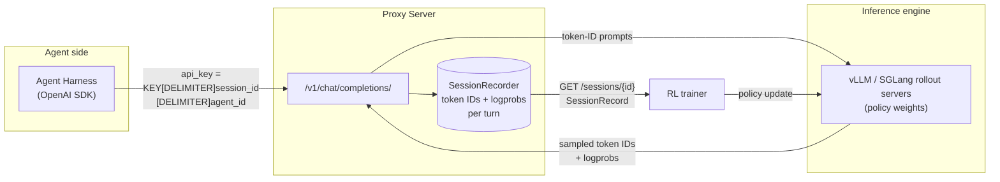
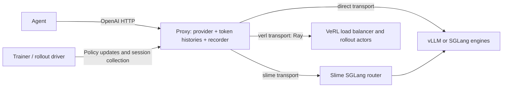

# RL Rollout Proxy Server

An OpenAI-compatible **recording proxy** that sits between agents and the RL rollout inference engine. Agents talk ordinary `chat/completions`; the proxy transparently captures, per session (= one rollout trial), the exact **prompt token IDs, completion token IDs, and logprobs** of every turn — the data an RL trainer needs — while enforcing **strict token-in-token-out (TITO)** so that recorded tokens are byte-identical to what the policy actually consumed and sampled.

> **Core design** — from the agent's perspective there is nothing proxy-specific except the composed API key.

## Role in RL training

Agentic RL trains a policy on multi-turn rollouts produced by an agent harness that only speaks the OpenAI text API. Training, however, needs token-level data, and **re-tokenizing conversation text does not reliably reproduce the tokens the model actually sampled** (token-merge drift at boundaries, chat templates stripping `<think>` blocks, tool calls re-serialized from parsed JSON, etc.). The proxy solves this by being the single point through which all agent LLM calls flow:


```mermaid
flowchart LR
    subgraph AG["Agent side"]
        A["Agent Harness<br/>(OpenAI SDK)"]
    end
    subgraph PX["Proxy Server"]
        P["/v1/chat/completions/"]
        R[("SessionRecorder<br/>token IDs + logprobs<br/>per turn")]
    end
    subgraph INF["Inference engine"]
        V["vLLM / SGLang rollout servers<br/>(policy weights)"]
    end
    T["RL trainer"]

    A -- "api_key =<br/>KEY[DELIMITER]session_id<br/>[DELIMITER]agent_id" --> P
    P -- "token-ID prompts" --> V
    V -- "sampled token IDs<br/>+ logprobs" --> P
    P --> R
    R -- "GET /sessions/{id}<br/>SessionRecord" --> T
    T -- "policy update" --> V
```

Each rollout is one **session**, which runs one or more **agents**. The session id and agent id are embedded in the API key the agent is given (**keyed routing**):

```python
client = OpenAI(
    base_url = f"{proxy_url}/v1",
    api_key  = f"{REAL_API_KEY}{DELIMITER}{session_id}{DELIMITER}{agent_id}",   # e.g. "sk-xxx-trial_042-agent_001"
)
```

The proxy authenticates the `REAL_API_KEY` part, extracts the session id and agent id, and opens the session lazily on the first request.

### Multi-agent rollouts

A rollout may spawn **several agents**; each is provisioned with a key naming its own agent id:

```python
api_key = f"{REAL_API_KEY}{DELIMITER}{session_id}{DELIMITER}{agent_id}"   # e.g. "sk-xxx-trial_042-planner"
```

Each `(session_id, agent_id)` pair owns an **independent strict-TITO token stream** — its own conversation, model pin, turn serialization, and sticky endpoint binding — so a rollout's agents converse and generate concurrently without touching each other's streams. Internally, the inference side keys everything on `{session_id}-{agent_id}`, using a fixed `-` separator regardless of the configured API-key delimiter. The rollout stays the unit of recording and lifecycle: all agents' turns land in the one `SessionRecord`, in recorder append order (which can differ from HTTP request arrival order) and tagged with their `agent_id`, and the session endpoints below fetch, complete, and delete the whole rollout — `DELETE` releases every agent's stream.

After the rollout, the driver collects the record:

| Endpoint                       | Purpose                                                  |
| ------------------------------ | -------------------------------------------------------- |
| `POST /v1/chat/completions`    | Agent-facing OpenAI endpoint (keyed routing)             |
| `GET /sessions/{id}`           | Fetch the `SessionRecord` (all turns)                    |
| `POST /sessions/{id}/complete` | Mark the rollout finished                                |
| `DELETE /sessions/{id}`        | Free the record and every agent stream's inference state |
| `GET /health`                  | Process liveness, reports `{"status":"ok"}`              |

Each turn in a `SessionRecord` contains `agent_id`, `request_messages`, `prompt_token_ids`, `new_conversation`, `completion_text`, `completion_token_ids`, `completion_logprobs`, `finish_reason`, `weight_version`, and parsed `content`, `reasoning_content`, and `tool_calls`.

`weight_version` is the policy version the engine reported for that turn. A trainer that updates weights between rollout steps needs it to prove a rollout was on-policy: a session whose turns carry more than one version straddled a weight update, and the samples it yields silently mix two policies. It is `null` when the backend reports none (vLLM's OpenAI API), and a re-served lost-response retry reports the version its tokens were *sampled* under rather than the current one.

`request_messages` and `prompt_token_ids` store only the turn's **delta** — the messages / prompt tokens the request appended beyond the agent's previous turn — never the full history, which would grow the record (in memory and on disk) quadratically with the conversation. The assistant echo that opens a continuation's delta is not stored either: it is reconstructed from the previous turn's parsed `content`, `reasoning_content`, and `tool_calls`, so a continuation's `request_messages` hold only the new non-assistant messages. The echo's content is not compared with the completion; reconstructed messages are canonical history and may differ from the submitted assistant echo. Strict TITO (below) makes the **prompt-token delta** lossless: every continuation prompt strictly extends its agent's token stream. A reader rebuilds turn N's canonical messages and exact prompt tokens by concatenation **over the turns sharing that turn's `agent_id`**:

```
full_messages_N = full_messages_{N-1} + [assistant_{N-1}] + request_messages_N
full_prompt_N   = full_prompt_{N-1} + completion_token_ids_{N-1} + prompt_token_ids_N
```

where `assistant_{N-1}` has `role: "assistant"`, turn N-1's `content`, and its `reasoning_content` and `tool_calls` when present. Raw `completion_text` can include special tokens and tool markup and must not replace parsed `content`. Both reset at every turn whose `new_conversation` is `true` (the agent's first turn, or a request that opened a fresh conversation — see strict TITO below): such a turn stores the full request instead of a delta. HTTP opening requests cannot contain pre-existing assistant history. Direct `SessionRecorder` callers can supply such history, which is preserved in the opening record.

## Persisted session records

When `save_rollout_sessions` is enabled (the default), the proxy attempts to write each `SessionRecord` as JSON after **every turn**, without requiring `/sessions/{id}/complete`. The default path is `proxyserver/sessions/{yyyy}-{mm}-{dd}-{hh}-{MM}-{ss}/{session_id}.json`, using a directory stamped with the server start time. The file uses the same record schema as `GET /sessions/{id}`, with logprobs and routed-experts blobs included only when their persistence flags are enabled. Deleting a session frees the in-memory record but keeps any successfully written snapshot. Writes use a temp file followed by an atomic rename, so readers do not see a partially replaced record. Filesystem write failures are logged without failing the completion request; disk snapshots are therefore not guaranteed to contain every recorded turn.

## Strict token-in-token-out (TITO)

The inference side keeps, per stream (one per agent of a session — see multi-agent rollouts above), the **authoritative token stream** — the exact prompt tokens fed to the engine plus the exact completion tokens it sampled — and builds every follow-up prompt as

```
prompt_{N+1} = prompt_N + completion_ids_N + gap + delta(new user/tool messages)
```

where `delta` tokenizes *only the new messages*, never the history. The assistant text echoed back by the agent is ignored for tokenization; the cached sampled tokens are authoritative. Any request that cannot be built as a strict extension of the session's stream — edited history, unexpected roles — is **rejected with an error**, never silently re-tokenized: a failed rollout is recoverable, a corrupted one is not.

`gap` closes the assistant message the way the chat template does. For example, Qwen ends every message with `<|im_end|>\n`, but the engine stops *at* the sampled `<|im_end|>` and the delta render starts fresh at `<|im_start|>` — so that trailing newline belongs to neither, and without it every turn boundary would read `<|im_end|><|im_start|>user` where the template writes `<|im_end|>\n<|im_start|>user`: one token off the format the checkpoint was trained on, in the engine prompt *and* in the recorded stream the trainer rebuilds. The proxy therefore appends whichever part of that ending the completion did not itself carry — the bare newline after a natural stop, the whole `<|im_end|>\n` after a turn truncated at `max_tokens`. The ending comes from the model profile (Llama uses `<|eot_id|>` without a trailing newline). The gap is part of the turn's recorded `prompt_token_ids`, so the reconstruction formula above is unchanged.

After exact retries are handled, a request carrying **no assistant message at all** can open a **new conversation** on the session: its full render starts a fresh stream, replacing the cached one. One exception is an assistant-free request that strictly extends the previous opening request; it is rejected as a continuation missing its assistant echo, because resetting would discard the sampled turn it is answering. Other fresh conversations contain no sampled assistant history to re-tokenize. Agents that run several sequential conversations under one session id are served this way; each conversation's turns land in the same `SessionRecord`.

One more shape is **recovered** rather than rejected: a request whose **normalized messages equal the previous request's normalized messages** on the same agent stream. For example, a plain text content string and an equivalent multipart text representation match after normalization. This is treated as a lost-response retry: while the turn remains cached and its replay allowance remains, the proxy re-serves the same tokens and logprobs without another generation. Replay matching excludes top-level `tools` and sampling parameters, so changing those fields alone still returns the cached turn; the stream's model pin is checked first. This covers the stream's **opening** request too. A fresh conversation requires different normalized, assistant-free messages that pass the missing-echo check above; an agent that means to re-sample the same opening prompt opens a new session instead. See [Timeouts, retries, and cleanup](#timeouts-retries-and-cleanup).

## Serving architecture

The proxy runs its inference provider in the same process as the HTTP server. The engines can run on remote GPU machines. The provider owns tokenization, per-agent token histories, inference calls, and tool parsing; the server owns session recording and OpenAI response formatting.


```mermaid
flowchart LR
    A[Agent] -->|OpenAI HTTP| P[Proxy: provider + token histories + recorder]
    P -->|direct transport| E[vLLM or SGLang engines]
    P -->|slime transport| R[Slime SGLang router]
    R --> E
    P -->|verl transport: Ray| V[VeRL load balancer and rollout actors]
    T[Trainer / rollout driver] -->|Policy updates and session collection| P
```

There are three transports, all using the same in-process provider pipeline:

| Transport | Provider                | Backend                                      | Required target                                           |
| --------- | ----------------------- | -------------------------------------------- | --------------------------------------------------------- |
| `direct`  | `DirectRolloutProvider` | vLLM `/v1/completions` or SGLang `/generate` | `inference_engine_base_url`                               |
| `slime`   | `SlimeRolloutProvider`  | SGLang `/generate` through Slime's router    | `router_url`                                              |
| `verl`    | `RayRolloutProvider`    | VeRL vLLM or SGLang rollout actors over Ray  | `verl_load_balancer` (named actor), or an injected handle |

Direct transport assigns each agent stream to an endpoint round-robin and keeps that binding until deletion. Slime delegates placement to its router and sends the stream ID in `X-SMG-Routing-Key`; a router using `consistent_hashing` can use this for prefix-cache affinity.

With the HTTP transports, both engines receive token-ID prompts. vLLM returns sampled IDs through `return_tokens_as_token_ids`; SGLang returns `output_ids`, with the logprob triples as a fallback when that field is absent. The proxy decodes the sampled IDs using its bundled tokenizer. Both engines' native `stop`, `length`, and `abort` reasons are authoritative, including a natural stop on the final permitted token. Missing or unknown reasons fall back to the requested token budget. Empty, aborted, or logprob-misaligned completions are rejected before commit.

## Installation and startup

```bash
python -m pip install -r requirements.txt
export PROXY_API_KEY='<shared-key>'
```

For Slime, point the proxy at the router on the GPU cluster:

```bash
INFERENCE_ENGINE=sglang python -m proxyserver.cli \
  --transport-mode slime \
  --router-url http://<router-host>:32005 \
  --context-length 262144 \
  --no-return-routed-experts
```

The bundled Slime config enables routing capture. This example disables it; omit `--no-return-routed-experts` when the engines have `enable_return_routed_experts` enabled and the trainer needs routing replay data.

For direct vLLM access:

```bash
python -m proxyserver.cli \
  --transport-mode direct \
  --inference-engine-base-url http://<engine-host>:8000/v1 \
  --inference-engine-api-key '<engine-key>'
```

Set `INFERENCE_ENGINE=sglang` for direct SGLang access. Multiple engine URLs are supported; supply one API key per URL or one shared key. All endpoints should serve the model family selected by the request. vLLM's served model ID is discovered through `/v1/models`; a mismatch with the agent's claimed model is logged, so verify model/tokenizer identity before training.

Target values can also be supplied in YAML. **Startup requires the selected transport's target**: a missing router URL, missing/blank direct engine URLs, or missing VeRL load balancer fail before the server starts. `GET /health` reports `{"status":"ok"}` for every transport; it checks process liveness, not engine readiness.

### VeRL

Run the proxy in an environment with the trainer's **matching Ray and VeRL versions**. `requirements.txt` includes Ray; align its version with the trainer when deploying. VeRL and its dependencies must be importable to deserialize its rollout results. The trainer must already have started the cluster, rollout actors, and load balancer. HTTP transports do not initialize Ray.

For a standalone proxy, give the trainer's load-balancer actor a name when creating it with Ray's `.options(name="rollout_load_balancer", namespace="training")`. Supply that same name and namespace to the proxy:

```bash
INFERENCE_ENGINE=vllm python -m proxyserver.cli \
  --transport-mode verl \
  --ray-address auto \
  --ray-namespace training \
  --verl-load-balancer rollout_load_balancer
```

`auto` connects to an existing local Ray cluster; use the appropriate cluster address when connecting elsewhere. Set `INFERENCE_ENGINE=sglang` for VeRL's SGLang actors. For an unnamed actor, embed the proxy in a process that already has its handle:

```python
from proxyserver.cli import run_standalone_proxy

# Ray is already initialized; load_balancer is the trainer's ActorHandle.
run_standalone_proxy(transport_mode="verl", load_balancer=load_balancer,
                     api_key="<shared-key>")
```

In an existing async application, construct `proxyserver.rollout_provider.RayRolloutProvider(load_balancer, inference_engine="vllm")`, omitting the Slime routing-capture callbacks. Call `provider.start()` before serving and `await provider.aclose()` after stopping the proxy.

The provider follows VeRL's [load-balancer interface](https://github.com/verl-project/verl/blob/main/verl/workers/rollout/router.py) and [rollout actor calls](https://github.com/verl-project/verl/blob/main/verl/workers/rollout/llm_server.py): acquire a server using the agent stream ID, call `generate` with token IDs and a fresh request ID, and release the reservation on success, failure, or cancellation. Both older acquire/release-only balancers and routers declaring required acquisition/release fields are supported. Custom routers may request `prompt_ids` and `sampling_params` at acquisition and `request_id` at release.

VeRL returns sampled IDs and logprobs directly. `aborted` is rejected; explicit `stop`/`length` reasons are preserved. VeRL vLLM's `completed` reason loses the stop-versus-length distinction, so the proxy infers it from the requested token budget. This cannot distinguish EOS at the budget boundary or truncation at a smaller actor-side context limit. Context clamping belongs to the VeRL actors. The recorded `weight_version` uses an explicit result version when supplied, otherwise `extra_fields.global_steps`; the trainer must update that step consistently with weight updates.

This transport supports text/token rollouts, sampling controls, tool parsing, retries, and session recording. The trainer remains responsible for scheduling rollouts, synchronizing weights, collecting records, and converting them into training batches. VeRL routing-replay tensors and multimodal inputs are not integrated. Session deletion requests cancellation of the active Ray generation and awaits the Ray task result before releasing the reservation. Ray cancellation is best-effort; backend GPU cancellation depends on the actor implementation. Closing the proxy disconnects only a Ray connection it created; it does not kill trainer-owned actors or shut down a borrowed Ray connection.

## Configuration

The available files are `proxyserver/configs/vllm-direct.yaml`, `sglang-direct.yaml`, `sglang-slime.yaml`, `vllm-verl.yaml`, and `sglang-verl.yaml`. Selection uses `$INFERENCE_ENGINE` (default `vllm`) and `$TRANSPORT_MODE` (default `direct`), with `--transport-mode` overriding the latter. Use `--config PATH` to select a file explicitly. Explicit CLI values override its corresponding settings. Target placeholders must be replaced or overridden.

A Slime configuration:

```yaml
inference_engine: sglang
transport_mode: slime
proxy_api_delimiter: "-"
host: 0.0.0.0
port: 9400
router_url: http://<router-host>:32005
router_api_key: null
context_length: 262144
rollout_session_dir: sessions
log_dir: logs
save_rollout_sessions: true
save_rollout_logprobs: true
return_routed_experts: false
save_rollout_routed_experts: false
```

Relative storage directories are resolved under `proxyserver/`. Session snapshots and error logs use `{server-start-timestamp}/` subdirectories. Each error file is named `{session_id}.log`, with agent IDs on its lines. `save_rollout_logprobs: false` omits logprobs from disk only; in-memory records still include them.

Direct configurations replace the router fields with:

```yaml
inference_engine_base_url: ["http://<engine-host>:8000/v1"]
inference_engine_api_key: ["<engine-key>"]
```

VeRL configurations use these fields instead of HTTP targets:

```yaml
ray_address: auto
ray_namespace: training
verl_load_balancer: rollout_load_balancer
```

Direct transport discovers context limits from vLLM's `/v1/models` (`max_model_len`) or SGLang's `/get_server_info` (`context_length`, falling back to `max_req_input_len`). Slime's router cannot report the engine window, so configure `context_length` to match the engines. Without it the proxy warns and leaves context clamping disabled. With a known window, the provider clamps each request's completion budget to the remaining context; a prompt already filling the window is rejected.

### Sampling and tokenizer identity

Sampling precedence is:

```text
runtime overrides > config sampling_overrides > request > bundled generation_config.json > engine defaults
```

Override layers accept `temperature`, `top_p`, `top_k`, `min_p`, `repetition_penalty`, `presence_penalty`, and `frequency_penalty`. Token limits and stop conditions stay request-owned. The removed `sampling_defaults` config field is rejected to avoid silently changing policy behavior.

| Endpoint                               | Purpose                                                                    |
| -------------------------------------- | -------------------------------------------------------------------------- |
| `GET /sampling_overrides`              | Read `{config, runtime, effective}` policy layers                          |
| `PUT /sampling_overrides`              | Replace the runtime layer; `{}` clears it                                  |
| `GET /tokenizer_fingerprint?model=...` | Read tokenizer identity and serving-template pins                          |
| `GET /routed_experts`                  | Read Slime capture settings                                                |
| `PUT /routed_experts`                  | Set capture with `{"enabled": true}`, `false`, or `null` to restore config |

The PUT endpoints require `Authorization: Bearer <PROXY_API_KEY>` using the bare configured key. These GET endpoints are open. Routing capture endpoints return 501 with direct and VeRL transports. Custom embedded handlers without the corresponding callbacks also return 501 for unsupported controls.

`tokenization/mapping.json` maps each accepted model name to a profile. Profiles declare the bundled tokenizer, generation header, assistant ending, reasoning parser, and tool-call parser. A stream is pinned to its initial model; a model switch is a 400. Unknown model names return 404. See [tokenization/README.md](proxyserver/tokenization/README.md) for the token format and bundled assets. Verify tokenizer fingerprints and pin the serving template before training.

Built-in parsers support Qwen's XML tool calls (`qwen3_coder`), Hermes JSON blocks (`hermes`), and Llama's JSON calls (`llama3_json`). Parsed calls become OpenAI `tool_calls`; the raw completion tokens and text remain in the record. Reasoning and special-token cleanup affect agent-visible content only. An embedding application may inject a parser factory.

### Routing replay capture

Slime transport supports Rollout Routing Replay (R3). Enable `return_routed_experts` or `--return-routed-experts` and launch engines with `enable_return_routed_experts` (Slime's `--use-rollout-routing-replay` enables engine support). Capture requested from an engine that does not supply it fails the turn.

The proxy requests routing offsets for continuations, repacks engine int32 expert IDs as uint8, and accumulates a blob per agent in `SessionRecord.routed_experts`. Aligned deltas append; complete captures can supersede earlier coverage. An engine that ignores the offset may return a full capture, which the proxy slices locally. Invalid extensions are dropped rather than corrupting recorded coverage.

`GET /sessions/{id}` includes the blobs. Disk snapshots omit them unless `save_rollout_routed_experts: true`, since rewriting a large capture after every turn is expensive. A runtime capture toggle lets the trainer enable capture for training and disable it for evaluation.

## Timeouts, retries, and cleanup

The provider's HTTP timeout defaults to 900 seconds. Configure agent-side timeouts for your expected turn length; SSE formatting does not shorten generation time.

- A client timeout or handler cancellation leaves the shielded generation-and-recording pipeline running. Its completion is recorded, and a retry with matching normalized messages receives the cached result, subject to cache retention and the replay cap.
- Per-stream locks serialize requests through generation, parsing, and recording, including retries racing a still-running original. Retries reuse the cached parsed response, preserving tool-call IDs. Different agents can generate concurrently.
- The recorder deduplicates repeated deliveries of an agent's last turn. Cached-turn replay is capped at four re-serves by default; use a new session to intentionally resample an identical opening prompt.
- Failures before commit leave the token stream intact. After two deterministic upstream 4xx rejections of matching normalized messages, further matching requests fail fast using the stored error. This rejection match also excludes top-level tools and sampling parameters, so changing those fields alone does not bypass a cached rejection. Transient 408/425/429 and 5xx responses do not trigger this guard.
- `DELETE /sessions/{id}` tombstones the session, rejects straggler completions with 410, cancels active and queued work, waits for cleanup, and releases every agent's provider state. Concurrent deletions share cleanup, which survives caller cancellation. Tombstones last up to one hour; above 8,192 retained entries, the oldest are evicted earlier. An ID can be reused after its tombstone expires or is evicted. Persisted session files remain.
- `POST /sessions/{id}/complete` marks the record completed; it does not release token histories. Fetch records before deletion and always delete finished sessions.

`stream: true` returns OpenAI SSE chunks **after** the entire completion is generated, validated, and recorded. It is response-format compatibility rather than incremental token delivery.

## Tests

```bash
bash test/test_all.sh --offline  # no inference endpoints needed
bash test/test_all.sh            # also exercises configured live engines
```

See [test/README.md](test/README.md) for endpoint fixtures and coverage, and [sandbox/README.md](sandbox/README.md) for session collection and cleanup.
