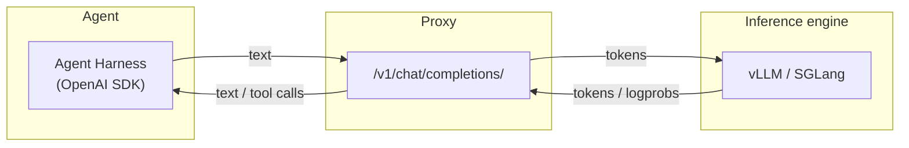

# Tokenizers, Tool-call Parsers & Model Profiles

`mapping.json` maps each served model name (provided by agents) to a **profile** — a small module in this directory that declares everything format-specific about that model family in one place:

```json
{ "Qwen3.5-9B": "qwen3_5", "Llama-3.1-8B-Instruct": "llama3_1", ... }
```

| Model names                                                                 | Profile    | Tokenizer dir | Tool-call parser | Reasoning |
| --------------------------------------------------------------------------- | ---------- | ------------- | ---------------- | --------- |
| `Qwen3.5-*` (`-4B`, `-9B`, `-9B-Base`, `-27B`, `-35B-A3B`, `-35B-A3B-Base`) | `qwen3_5`  | `Qwen3.5/`    | `qwen3_coder`    | `<think>` |
| `Llama-3.1-8B-Instruct`, `Llama-3.1-70B-Instruct`                           | `llama3_1` | `Llama-3.1/`  | `llama3_json`    | none      |

A profile (`base.py` defines the contract; `qwen3_5.py` / `llama3_1.py` are the two shipped) **states** its strict-TITO chat markers (the assistant *generation prompt* and *turn end*), its tool-call parser class, and its reasoning parser. They are **stated, not inferred** — byte-exactness of the recorded stream is too important to guess: ChatML (Qwen: `<|im_start|>assistant\n` / `<|im_end|>\n`) and Llama 3 (`<|start_header_id|>assistant<|end_header_id|>\n\n` / `<|eot_id|>`) each declare their own. `TokenStreamManager` still measures and strips any implicit per-render prefix a template prepends (e.g. Llama's `bos` token and its default dated system block) — that measurement is self-validating (a wrong measurement fails loudly, never corrupts). `test/test-profiles.py` proves a built stream is byte-identical to the template's own render, for both families, the same oracle `test/test-token-stream.py` applies to Qwen.

**Adding a model family** is a small `<profile>.py` here plus its bundled tokenizer directory, and a `mapping.json` line pointing each model name at the profile. The reasoning parser (`base.ThinkReasoning` / `NoReasoning`) is used by the tool parser (which strips reasoning before parsing) and can re-extract a recorded completion's reasoning from its `completion_text` — so a family's reasoning format lives in exactly one place.

**Adding a new tool-call dialect** (a format none of `qwen3_coder` / `hermes` / `llama3_json` cover) needs a parser class in `tool_parser.py` (in this directory) — or a training framework's own `tool_parser_factory` (keyed by the parser's `NAME`). `llama3_json` reads Llama's native `{"name": ..., "parameters": {...}}` (the whole assistant turn, no wrapper; a JSON array for parallel calls); it does not parse the `<|python_tag|>name.call(...)` builtin-tool spelling, which stays content. The bundled `Llama-3.1/chat_template.jinja` uses a **fixed** `Today Date` (not `strftime_now`), keeping renders deterministic for reproducible TITO.


## Why do we need a model's tokenizer and tool-call parser?

Overall, the proxy aims to guarantee TITO (token-in-token-out), as shown below:



For simplicity, we omit the verl load balancer and sglang router that sit between the proxy and the inference engine.

- The tokenizers in the proxy translate text to/from tokens.

- The tool-call parsers in the proxy translate tokens into tool calls.


## Patch

- For conversations without a genuine user query, the Qwen3.5 tokenizer throws an error `No user query found in messages`. Refer to [https://github.com/vllm-project/vllm/issues/36432](https://github.com/vllm-project/vllm/issues/36432). Hence, we patch its chat template [Qwen3.5/chat_template.jinja](Qwen3.5/chat_template.jinja).

- A render that **starts** with a `tool` message lost its `<|im_start|>user` header: the original template guards the header with `loop.previtem and loop.previtem.role != "tool"`, and `loop.previtem` is undefined on the first iteration (upstream assumes a tool message always follows an assistant one). The strict-TITO inter-turn delta renders exactly such conversations — the new tool results alone (see `proxyserver/token_stream.py`) — so every tool-turn prompt (and the recorded training stream) came out malformed: `…<tool_call>…<|im_end|>\n<tool_response>…` with no `user` block opened. Patched to `loop.first or loop.previtem.role != "tool"` in [Qwen3.5/chat_template.jinja](Qwen3.5/chat_template.jinja); full-conversation renders are byte-identical to upstream ([Qwen3.5/chat_template-legacy.jinja](Qwen3.5/chat_template-legacy.jinja) keeps the pristine original).
