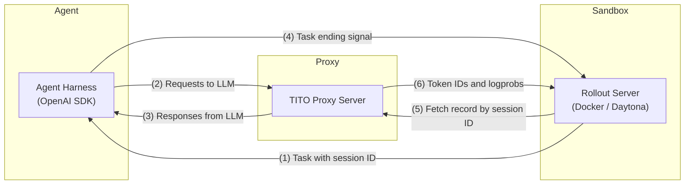

## Aligning with sandboxes

The sandbox (a Docker / Daytona container) mints a session ID, hands the agent its task, and — once the agent signals the task is over — collects the recorded token IDs and logprobs from the proxy and ends the session.



(1) The sandbox starts a rollout: it generates a fresh `session_id` and gives each agent the task plus the proxy's base URL and its own composed key `{PROXY_API_KEY}{DELIMITER}{session_id}{DELIMITER}{agent_id}` — every agent owns an independent TITO token stream, and the rollout's one record tags each turn with its `agent_id`.
(2) The agent talks ordinary OpenAI `chat/completions` to the proxy; the session opens lazily on the first request.
(3) The proxy returns and records every turn's token IDs and logprobs.
(4) The agent reports the task finished (framework-specific — e.g. a submit call into the sandbox).
(5) The sandbox fetches the full `SessionRecord` from the proxy.
(6) The sandbox ends the session: marks it completed, then deletes it so the proxy frees the in-memory record and the inference side drops the session's token stream.

## Session API used by the sandbox

| Endpoint                       | Purpose                                                                                       |
| ------------------------------ | --------------------------------------------------------------------------------------------- |
| `GET /sessions/{id}`           | Fetch the `SessionRecord` — model, per-turn token IDs / logprobs / tool calls; 404 if unknown |
| `POST /sessions/{id}/complete` | Stamp `completed: true` into the (in-memory and persisted) record                             |
| `DELETE /sessions/{id}`        | Free the in-memory record and release per-session inference state                             |

## `utils.py`

[`utils.py`](utils.py) wraps the three endpoints in two helpers:

```python
from utils import get_session, end_session

PROXY_URL = "http://proxy-host:9400"

record = get_session(PROXY_URL, session_id)   # Step (5); None if unknown
train_on(record["turns"])                     # token IDs + logprobs per turn
end_session(PROXY_URL, session_id)            # Step (6): complete, then delete
```

Things to know:

- **Fetch before ending.** `GET /sessions/{id}` serves from the proxy's in-memory record, which `end_session` deletes. (The JSON the proxy persists under `proxyserver/sessions/` survives deletion — a crashed driver loses nothing.)
- **Always end sessions.** Deletion is what releases the sticky worker binding and the session's strict-TITO token stream, which grows with every turn — a sandbox that never ends sessions leaks inference-side memory across rollouts.
- **Turns are delta-encoded, per agent.** Each turn stores only the messages / prompt tokens its request appended beyond the same agent's previous turn; reconstruct by concatenating turns with the same `agent_id` (see the scheme in the [main README](../README.md)).
- Both calls are **idempotent** — ending an unknown or already-ended session is a 200 no-op. `end_session(..., delete=False)` marks the rollout completed but keeps it fetchable in memory.
